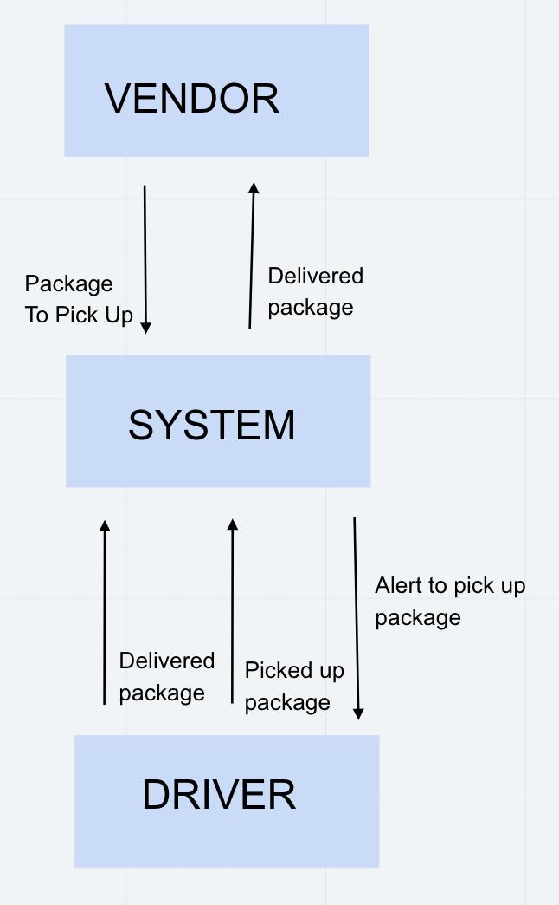

# caps

version: "1.0.4"

### Users stories

- As a vendor, I want to alert the system when I have a package to be picked up

- As a driver, I want to be notified when there is a package to be delivered

- As a driver, I want to alert the system when I have picked up a package and it is in transit

- As a driver, I want to alert the system when a package has been delivered

- As a vendor, I want to be notified when my package has been delivered

### 

add an env file into each 3 folders with: 
- PORT
- STORE_NAME

### UML
